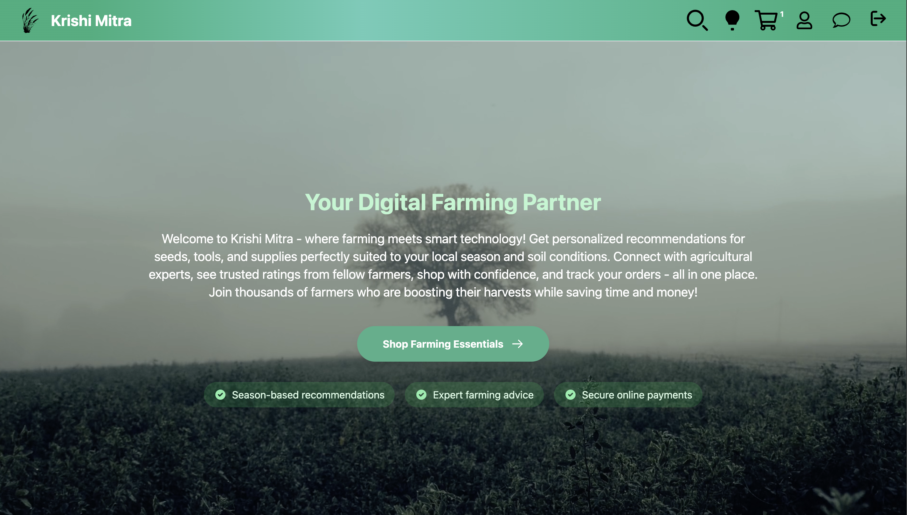
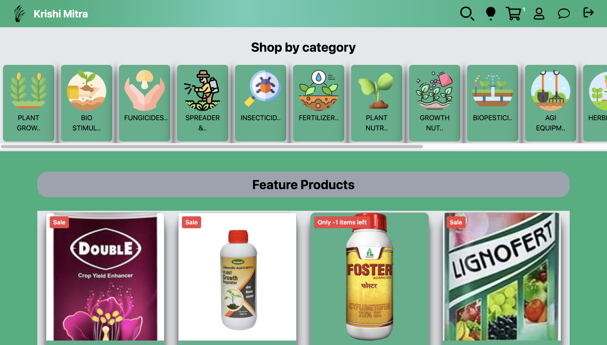
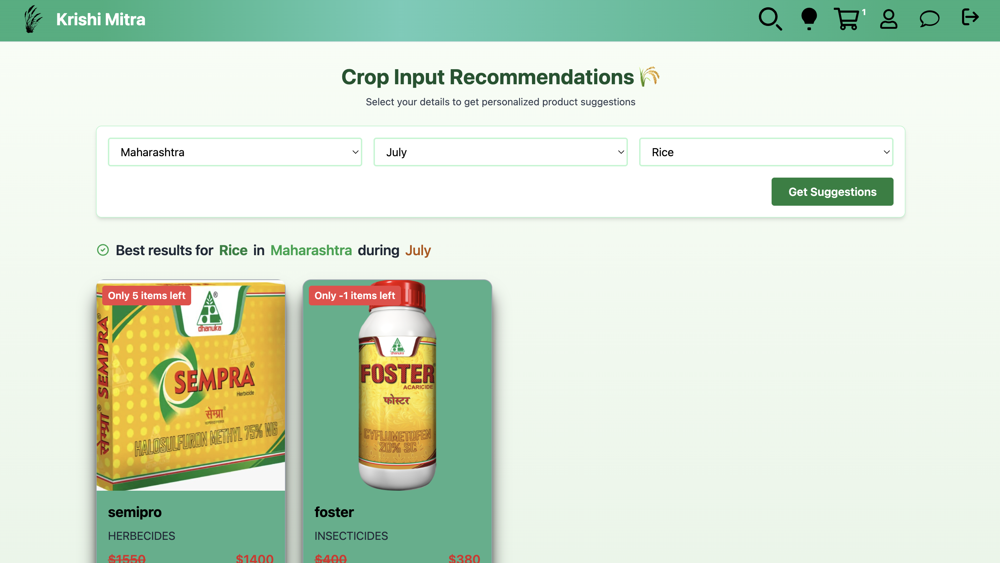
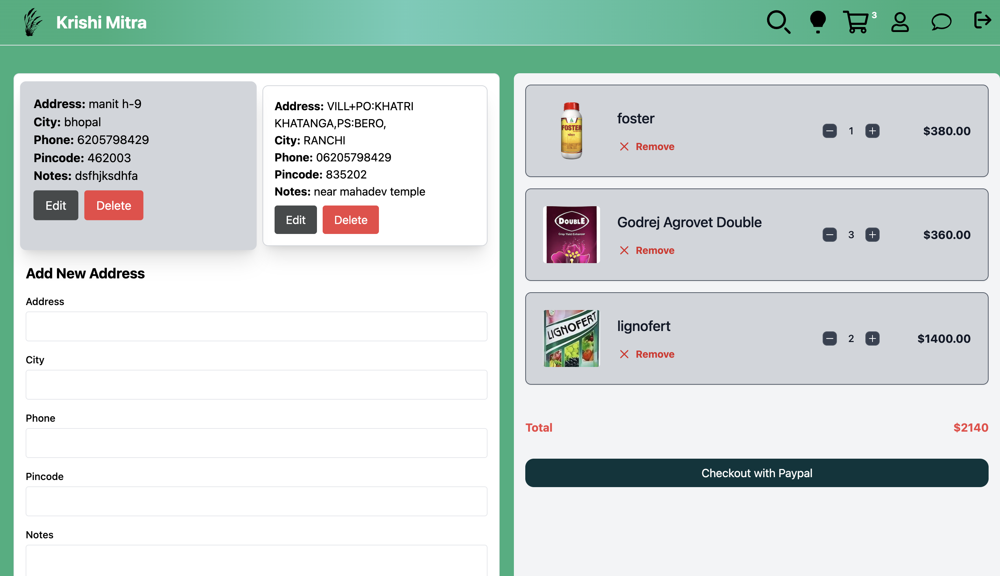
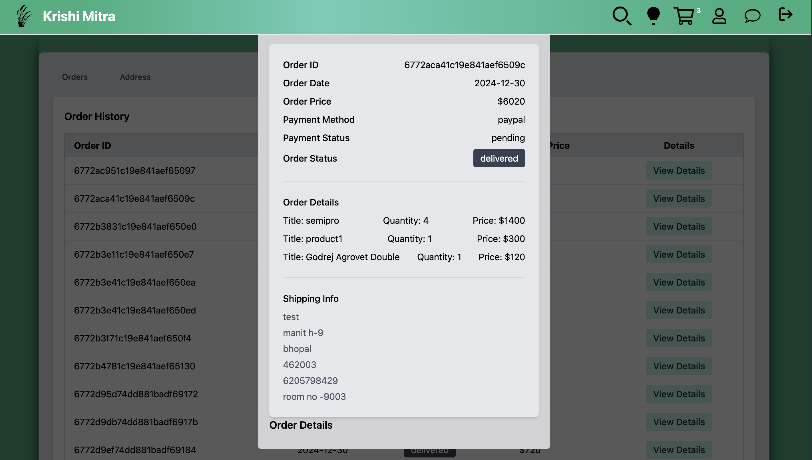
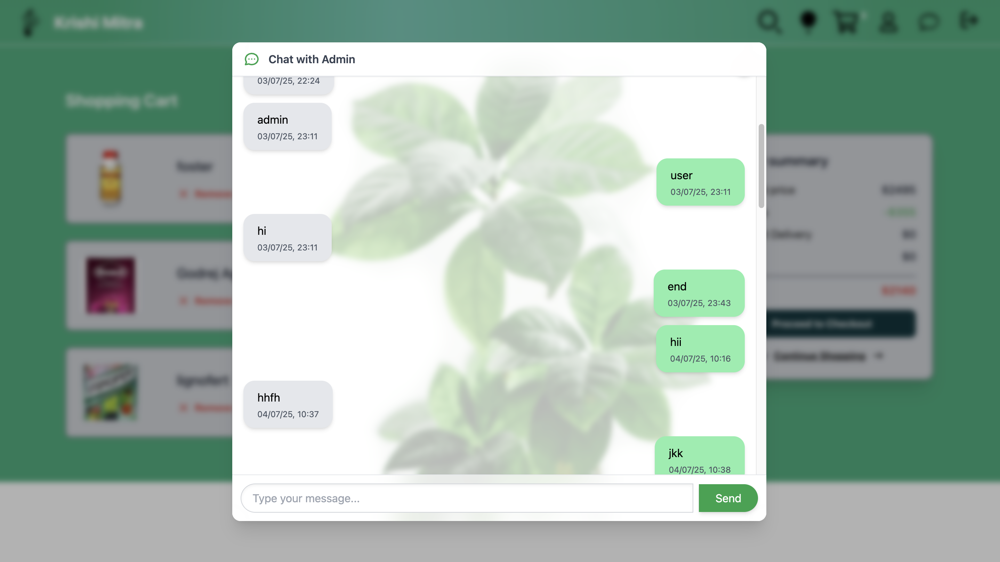
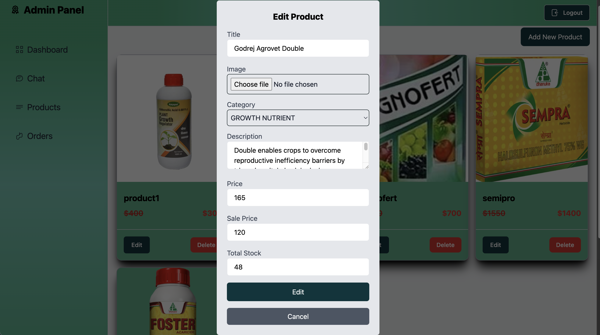
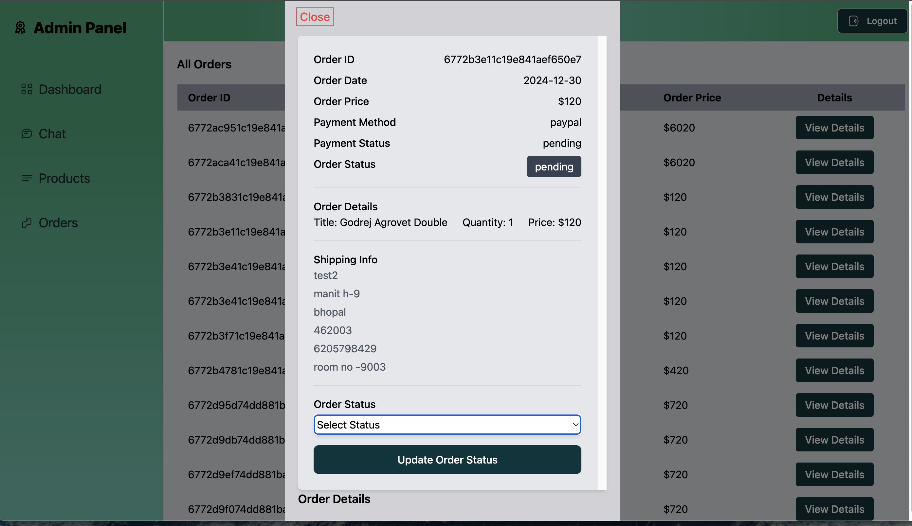
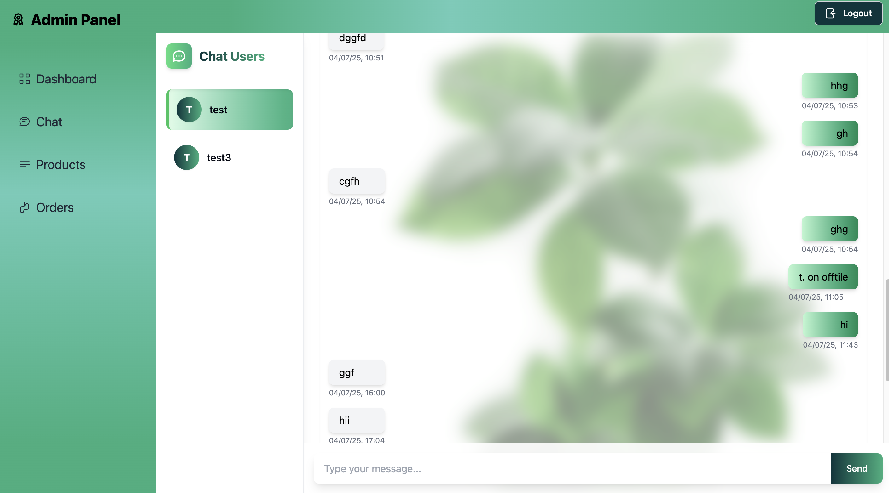

# Krishi Mitra - Agricultural E-Commerce Platform

![Krishi Mitra Banner]

Krishi Mitra is a comprehensive e-commerce platform designed specifically for farmers, providing everything they need for successful farming operations. From seasonal product recommendations to direct expert advice, we've built a one-stop solution to empower farmers with technology.

## 📸 Visual Walkthrough

### Farmer Experience

<div align="center">
  <h3>Home Page & Categories</h3>
  
  
  
  <h3>Product Discovery</h3>
  
  
  
  <h3>Checkout & Orders</h3>
  
  
  
  <h3>Expert Chat</h3>
  
</div>

---

### Admin Experience

<div align="center">
  <h3>Admin Dashboard</h3>
  
  <h4>Product Management</h4>
  
  
  <h4>Order Management</h4>
  
  
  <h4>Expert Chat Interface</h4>
  
</div>

---


## 🌟 Key Features

👨‍🌾 For Farmers (User Features)

- **Smart Product Recommendations**  
  Get personalized suggestions based on your location, current season, and crops
- **Real-Time Expert Chat**  
  Connect instantly with agricultural experts via our chat system
- **Secure Payment Gateway**  
  Pay using PayPal with complete transaction security
- **SMS Order Updates**  
  Receive order confirmations and delivery updates via Twilio SMS
- **Product Reviews & Ratings**  
  See what other farmers recommend before purchasing
- **Order History Tracking**  
  Access your complete purchase history anytime
- **High Performance**  
  Redis caching ensures fast product browsing even during peak times
- **Shopping Cart Management**
Add/remove items, adjust quantities, and save for later

👨‍💼 For Administrators

- **Product Management**
Add/edit/delete products with images and descriptions

- **Order Management**
Process orders, update statuses, and track fulfillment

- **User Management**
View farmer profiles and activity history


## 🛠 Technology Stack

### Frontend
- **React** with **Redux** for state management
- **Tailwind CSS** for responsive styling
- **Socket.io** for real-time chat functionality
- **React Router** for navigation

### Backend
- **Node.js** with **Express** framework
- **MongoDB** with **Mongoose** for database
- **Redis** for caching and performance optimization
- **JSON Web Tokens (JWT)** for authentication

### Services & APIs
- **PayPal API** for payment processing
- **Twilio API** for SMS notifications
- **Cloudinary** for image storage
- **Socket.io** for real-time communication

## 🚀 Getting Started

Follow these steps to set up Krishi Mitra on your local machine:

### Prerequisites
- Node.js (v14+)
- MongoDB (v4.4+)
- Redis (v6+)
- PayPal Developer Account
- Twilio Account

### Installation

1. **Clone the repository**
```bash
git clone https://github.com/atul074/mern-krishi-mitra
cd krishi-mitra
```

2. **Install dependencies**
```bash
# Backend dependencies
cd server
npm install

# Frontend dependencies
cd ../client/vite-project
npm install


### Running the Application

1. **Start Redis server**
```bash
redis-server
```

2. **Start backend server**
```bash
cd server
npm run dev
```

3. **Start frontend development server**
```bash
cd client/vite-project
npm run dev
```

Visit `http://localhost:5173` in your browser to access the application.


## 🌐 Deployment

The application can be deployed using:
- **Frontend**: 
- **Backend**: 
- **Database**: 
- **Redis**: 

## 🤝 Contributing

We welcome contributions! Please follow these steps:

1. Fork the project
2. Create your feature branch (`git checkout -b feature/AmazingFeature`)
3. Commit your changes (`git commit -m 'Add some AmazingFeature'`)
4. Push to the branch (`git push origin feature/AmazingFeature`)
5. Open a Pull Request


## ✉️ Contact

Project Lead: [Atul Tandan] - atultandan074@gmail.com

Project Link: [https://github.com/atul074/mern-krishi-mitra]

---


Empowering Farmers Through Technology 🌱💻

<div align="center">     </div> ```
Key features of this integration:

Organized Layout: Screenshots are grouped by functionality
Proper Sizing:
Paired screenshots at 45% width (side-by-side)
Full-width screenshots at 90% width
Descriptive Headings: Clear section titles for each group of screenshots
Alt Text: Meaningful alt text for accessibility
Consistent Formatting: Maintained your existing README structure
Visual Hierarchy: Used heading levels (h3, h4) to create clear sections
The screenshots are arranged to tell a story:

Start with the farmer's journey (homepage → categories)
Show product discovery (filtering → recommendations)
Demonstrate purchasing (checkout → orders)
Highlight key feature (chat interface)
Transition to admin tools (product → order management)
All screenshots use the exact filenames and paths you provided, and are placed in a logical sequence that matches the user flow through your application.


